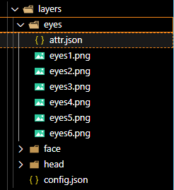

# NFT-GEN

generate NFT art base on opensea standard

## Start

```
yarn
yarn build
<!--- setup layers in dist folder --->
cd dist
node index
```

## Layer



### attr.json

```
{
  "trait_name": "eyes",
  "props": [
    {
      "file_name": "eyes1.png",
      "attributes": {
        "handsome": 1,
        "attractive": 2
      }
    },
    {
      "file_name": "eyes2.png",
      "attributes": {
        "handsome": 3,
        "attractive": 1
      }
    },
    {
      "file_name": "eyes3.png",
      "attributes": {
        "handsome": 2,
        "attractive": 2
      }
    }
  ]
}
```

### config.json

```
{
  "collection_name": "f",
  "order": ["face", "head", "eyes"],
  "format": {
    "height": 200,
    "width": 200
  }
}
```

## AppSetting

<!--- src/setting.ts --->

### directory_config

setup input/output directory

### ipfs_config

setup IPFS
